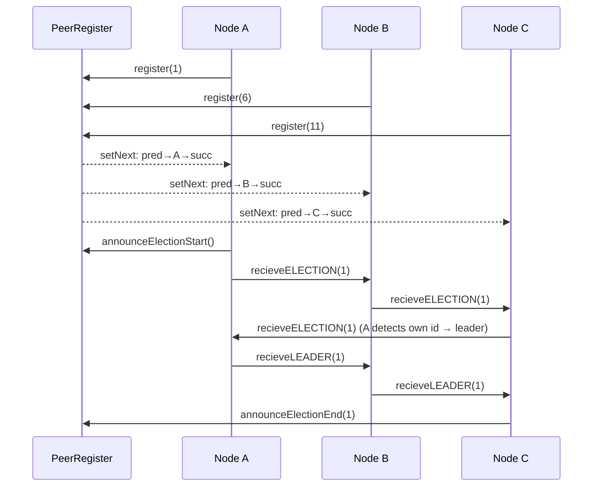

# LCR Leader Election Protocol — Peer Register Edition

A Java RMI implementation of the **Le Lann–Chang–Roberts (LCR)** leader election algorithm with a **central Peer Register** that coordinates ring formation and blocks late joiners during an election.

## Overview

* **PeerRegister / PeerRegisterImpl** expose registration and diagnostics:

  * `register(int id) : boolean` — accept a node if no election is in progress and wire it into the ring
  * `getSuccessor(int id) : Node` — return the successor stub chosen by the register
  * `isElectionInProgress() : boolean` — allow nodes to check state
  * `announceElectionStart() : void` — flip the in‑progress flag to prevent new registrations
  * `announceElectionEnd(int leaderId) : void` — clear flag and log the winner

* **Node / NodeImpl** are the participants. RPC methods (as defined in your code) are:

  * `recieveELECTION(int uid)` — forward/drop the candidate ID clockwise (method name spelled as in source)
  * `recieveLEADER(int uid)` — propagate the winner announcement once
  * `setNextNode(Node next)` and `getId()` — ring wiring helpers

* **App** is the process launcher for a node. It:

  * Ensures a local RMI registry on port 1099
  * Binds this process as `Node<id>`
  * Looks up the register under **`Node0`**
  * Registers the node (rewiring handled by the register)
  * Schedules the election start at a wall‑clock time

## Features

* ✅ Centralized join/wiring with insertion into a live ring (predecessor → new → successor)
* ✅ Election gating: register rejects joins while an election is active
* ✅ Simple console banners for both Peer Register and Nodes
* ✅ Wall‑clock **startAt** scheduling per node

## Architecture



## Project Structure

```
.
├─ App.java                 # Node launcher and scheduler
├─ Node.java                # RMI interface for node-to-node RPC
├─ NodeImpl.java            # Node logic (recieveELECTION / recieveLEADER)
├─ PeerRegister.java        # RMI interface for the register
├─ PeerRegisterImpl.java    # Register logic (join order, rewiring, gating)
└─ README.md
```

## Getting Started

### Prerequisites

* Java 17+ (or compatible)
* Maven or Gradle
* Windows console (uses `cmd /c cls` to clear screen); adjust if on macOS/Linux

### Build

```bash
# Maven
mvn clean package

# Gradle
./gradlew build
```

### Run

1. **Start the Peer Register** (binds as `Node0` by default, port 1099):

```bash
java PeerRegisterImpl
# or, explicitly:
java PeerRegisterImpl 1099 Node0
```

2. **Start each Node** (in separate terminals). Usage from code:

```text
Usage: java App <nodeId> <startAt(HH:mm:ss)>
```

Example (staggered starts):

```bash
java App 1 12:00:00
java App 6 12:00:02
java App 11 12:00:04
```

The app binds the node as `Node<id>`, looks up the register at `Node0`, registers, and schedules an election start. When the first node reaches its start time it calls `announceElectionStart()` to block further joins and then begins the election.

## Configuration

| Component | Setting      | Default    | Notes                                                                    |
| --------- | ------------ | ---------- | ------------------------------------------------------------------------ |
| Register  | RMI port     | 1099       | `PeerRegisterImpl` main will create the registry if missing              |
| Register  | Binding name | `Node0`    | Nodes look this up in `App`                                              |
| Node      | Start time   | required   | `HH:mm:ss` local time; if time already passed, it schedules for tomorrow |
| Node      | Binding      | `Node<id>` | Ex: `Node6`                                                              |

## Sample Output

```
=============================================
 _   _    ___   ____   _____
| \ | |  /   \ |  _ \ | ____|
|  \| | | | | || | | ||  _|
| |\  | | |_| || |_| || |___
|_| \_|  \___/ |____/ |_____|
     P R O C E S S [6]
---------------------------------------------
PORT : 1099
SCHEDULED START : 2025-09-24T12:00:02
=============================================
Process[6]: Registered with PeerRegister.
Process[6]: Scheduled to start election at: 12:00:02 ...
```

## Notes & Caveats

* Method names use the spelling **`recieveELECTION` / `recieveLEADER`** to match the source.
* The register depends on a consistent binding pattern (`Node<id>`) to wire the ring.
* On non‑Windows systems, replace the `cls` clear‑screen command with your platform equivalent.

## License

MIT (see LICENSE)
