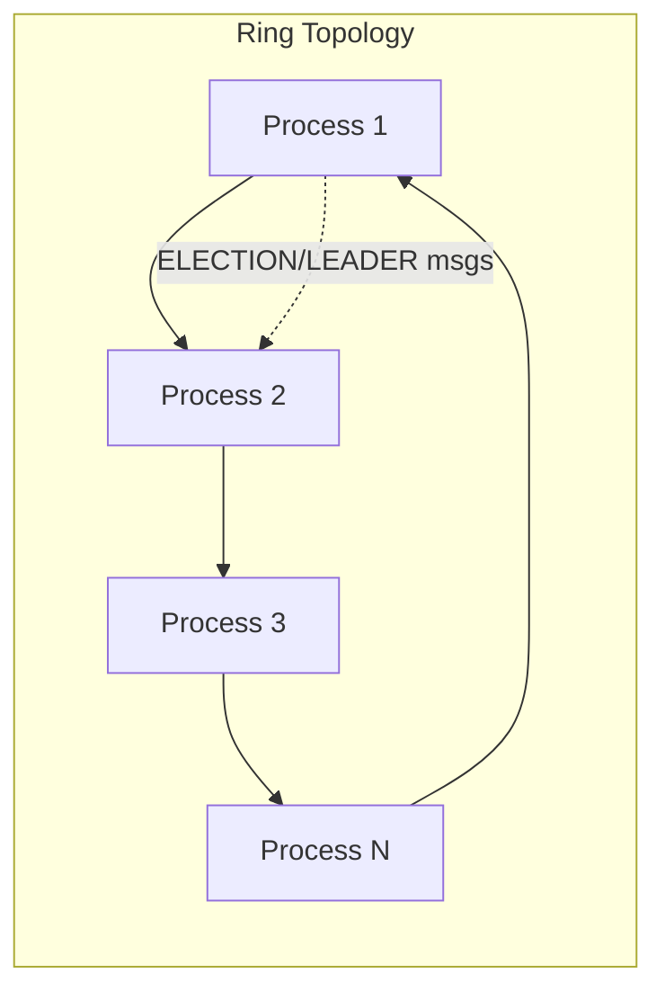

# LCR Leader Election (Java RMI)

A simple Java implementation of the **Le Lann–Chang–Roberts (LCR) Leader Election algorithm** using **Java RMI**. This project demonstrates distributed systems concepts, where processes (nodes) arranged in a ring topology elect a single leader.

---

## Table of Contents

* [Overview](#overview)
* [Features](#features)
* [Architecture](#architecture)
* [Project Structure](#project-structure)
* [Getting Started](#getting-started)

  * [Prerequisites](#prerequisites)
  * [Build](#build)
  * [Run](#run)
* [Usage](#usage)
* [Core Classes](#core-classes)
* [Testing](#testing)
* [License](#license)

---

## Overview

This project implements the **LCR Leader Election Algorithm** in a simulated distributed system using **Java Remote Method Invocation (RMI)**. Each node is represented as a process with a unique ID, connected in a ring topology. Nodes can initiate elections, forward election messages, and eventually learn the identity of the elected leader.

## Features

* ✅ Ring topology
* ✅ Election and leader announcement messages (`ELECTION(uid)` and `LEADER(uid)`)
* ✅ RMI‑based communication between processes
* ✅ Configurable start times for triggering elections

## Architecture



* Each process knows only its **successor** in the ring.
* `ELECTION(uid)` messages circulate clockwise until the highest UID completes a full round.
* The elected leader broadcasts `LEADER(uid)` once.

## Project Structure

```
LCR-RMI/
├─ Api.java          # RMI interface for election and leader messages
├─ ApiImpl.java      # Implementation of Api; handles election logic
├─ App.java          # Main entry point; bootstraps processes and RMI registry
├─ Node.java         # Simple data model for Node with unique ID
└─ README.md
```

## Getting Started

### Prerequisites

* Java 17+ (or compatible version)
* Maven or Gradle

### Build

```bash
mvn clean package
# or
gradle build
```

### Run

Each process is launched as a separate JVM instance:

```bash
java App <process_id> <nextProcess> <registryPort> <nextPort> <startAt(HH:mm:ss)>
```

Example:

```bash
java App 1 localhost 1099 1100 12:00:00
java App 2 localhost 1100 1101 12:00:05
```

## Usage

* Each process starts with a unique ID.
* At the scheduled `startAt` time, the election begins.
* The elected leader is displayed in the console logs.

Sample console output:

```
=============================================
 _   _    ___   ____   _____
| \ | |  /   \ |  _ \ | ____|
|  \| | | | | || | | ||  _|
| |\  | | |_| || |_| || |___
|_| \_|  \___/ |____/ |_____|
      P R O C E S S [2]
---------------------------------------------
PORT : 1100
CONNECTED TO: localhost AT PORT: 1101
=============================================
```

## Core Classes

| Class       | Responsibility                                                                            |
| ----------- | ----------------------------------------------------------------------------------------- |
| **Api**     | RMI interface defining `receiveELECTION(int uid)` and `receiveLEADER(int leaderID)`       |
| **ApiImpl** | Implements election logic: forwards messages, tracks leader, prevents duplicate elections |
| **Node**    | Encapsulates node identity (UID) with getter/setter                                       |
| **App**     | Main runner; starts processes, connects RMI registries, prints console UI                 |

## Testing

Run JUnit tests (if provided):

```bash
mvn test
# or
gradle test
```

## License

This project is licensed under the MIT License — see [LICENSE](./LICENSE) for details.